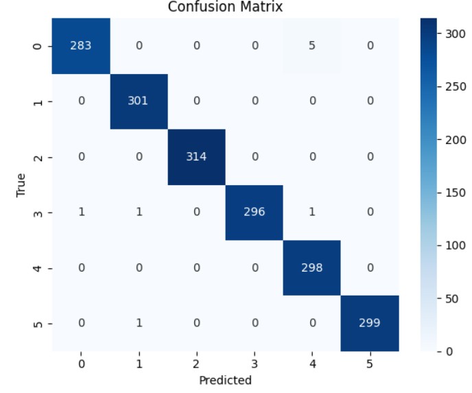

# Stell Surface Defect Classification using CNN (NEU Dataset)

## Title
Steel Surface Defect Classification using Convolutional Neural Networks (CNN)

## Description
This project implements a deep learning–based image classification system for identifying
surface defects in industrial steel images using the NEU surface defect dataset.
The goal is to automatically classify defect types using a Convolutional Neural Network (CNN).

The implementation was originally developed in Google Colab . The project focuses on correctness and clarity rather than
over-optimization.

## Dataset Information
- **Dataset Name:** NEU Surface Defect Dataset
- **Domain:** Industrial inspection / Computer Vision
- **Classes:** Six defect categories (e.g., Crazing, Inclusion, Patches, Pitted Surface, Rolled-in Scale, Scratches)
- **Data Type:** gray scale images
- **Source:** Public academic dataset used widely for defect detection research
- **Link:** https://www.kaggle.com/datasets/kaustubhdikshit/neu-surface-defect-database
<p align="center">
  
</p>

The dataset is organized into training and validation directories, with one subfolder per class.

## Project Workflow

<p align="center">
  
</p>

## Code Information
- **Language:** Python
- **Framework:** TensorFlow / Keras
- **Main File:** `neu_defect_classifier.py`
- **Original Environment:** Google Colab

The code covers:
- Dataset loading from directory structure
- Image normalization
- CNN model definition
- Training and validation
- Model saving
  
## Performance
<p align="center">
  
</p>

## Usage Instructions
1. Download or clone this repository.
2. Obtain the NEU dataset and arrange it as:
   ```
   data/
     train/
       class_1/
       class_2/
       ...
     valid/
       class_1/
       class_2/
       ...
   ```
3. Install the required dependencies (see Requirements).
4. Run the script:
   ```
   python neu_defect_classifier.py
   ```
5. The trained model will be saved as `neu_defect_classifier.h5`.


## Requirements
- Python 3.8+
- TensorFlow
- NumPy
- Matplotlib

Install dependencies using:
```
pip install tensorflow numpy matplotlib
```

## Methodology
1. Dataset extraction and organization by class.
2. Image resizing and normalization.
3. CNN architecture with increasing convolutional filters.
4. Training using Adam optimizer and categorical loss.
5. Evaluation on validation data.
6. Saving the trained model for later use.

No advanced techniques (transfer learning, hyperparameter tuning, or augmentation)
were applied beyond basic preprocessing.

## Citations
If you use the NEU dataset in academic work, cite the original dataset publication
associated with the NEU surface defect database.

## License & Contribution Guidelines
- **Code License:** Educational / academic use.
- Contributions are welcome for improvements such as better architectures,
  data augmentation, or performance evaluation metrics.
